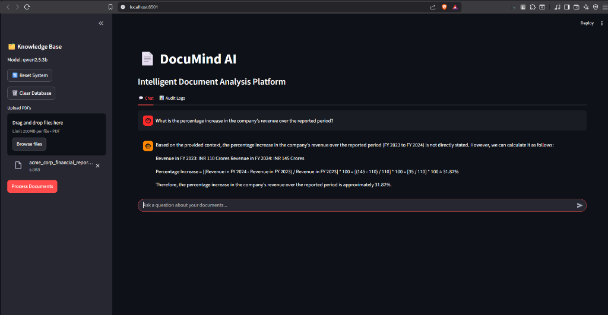
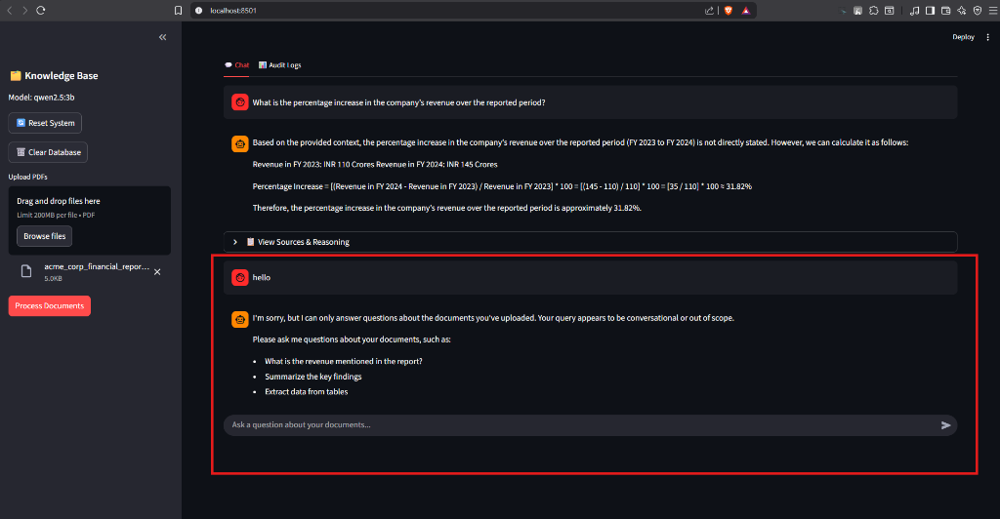
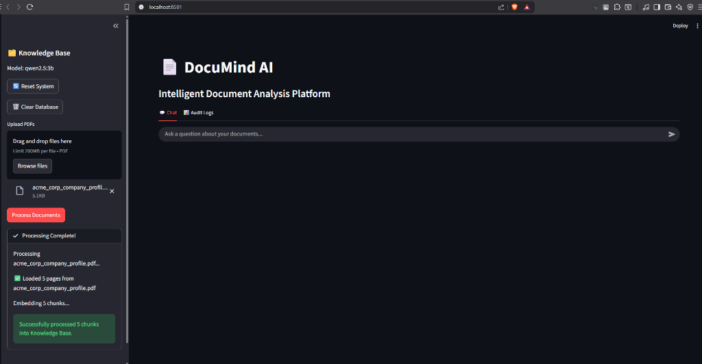

# 📄 DocuMind AI

<div align="center">

**Intelligent Document Analysis Platform**

*Chat with your PDFs using Local LLMs powered by Ollama*

[](https://www.python.org/downloads/)
[](https://streamlit.io/)
[](https://www.langchain.com/)
[](LICENSE)

[Features](#-features) • [Demo](#-demo) • [Installation](#-installation) • [Usage](#-usage) • [Tech Stack](#-tech-stack)

</div>

---

## 🎯 Overview

DocuMind AI is a powerful document analysis platform that enables you to have intelligent conversations with your PDF documents. Built on a multi-agent architecture with LangGraph, it provides accurate, citation-backed answers using local LLM inference via Ollama.

**🔒 Privacy-First:** All processing happens locally - no data leaves your machine!

---

## ✨ Features

### 🤖 **Intelligent Query Routing**
- Automatically classifies queries as document-related or conversational
- Prevents unnecessary processing for out-of-scope questions
- LLM-based classification with keyword fallback for robustness

### 📚 **Multi-Document Support**
- Upload and process multiple PDF files simultaneously
- Automatic text extraction and intelligent chunking
- Persistent vector storage with ChromaDB

### 💬 **Conversational Interface**
- Clean, modern chat UI built with Streamlit
- Real-time processing indicators
- Message history with context preservation

### 🔍 **Advanced Retrieval**
- Semantic similarity search using vector embeddings
- Top-k document retrieval (configurable)
- Context-aware response generation

### 📊 **Source Citations**
- Every answer includes document references
- Page numbers for easy verification
- Expandable source preview with document excerpts

### 🔄 **Multi-Agent Workflow**
- **Router Agent:** Query classification
- **Retrieval Agent:** Semantic document search
- **Extraction Agent:** Structured data extraction
- **Analysis Agent:** Response synthesis with citations

### 📈 **Audit & Monitoring**
- Complete query execution trail
- Step-by-step agent logging
- JSONL format for easy analysis

### 🎛️ **System Controls**
- Reset system state
- Clear vector database
- Real-time model configuration

---

## 🖼️ Demo

### Main Interface

*Ask questions and get instant answers with citations from your documents*

### Intelligent Query Routing

*Smart routing detects conversational queries and guides users to ask document-related questions*

### Document Processing

*Easy drag-and-drop PDF upload with real-time processing feedback*

---

## 🚀 Quick Start

### Prerequisites

- **Python 3.8+**
- **Ollama** installed and running ([Download](https://ollama.ai))
- 8GB+ RAM (16GB recommended)
- GPU optional (recommended for faster inference)

### Installation

1. **Clone the repository**
```bash
git clone https://github.com/yourusername/Documind.git
cd Documind
```

2. **Install dependencies**
```bash
pip install -r requirements.txt
```

3. **Set up Ollama**
```bash
# Pull the default model
ollama pull qwen2.5:3b

# Verify Ollama is running
ollama list
```

4. **Configure environment** (optional)
```bash
cp .env.example .env
# Edit .env with your settings
```

5. **Run the application**
```bash
streamlit run app.py
```

6. **Open in browser**
```
http://localhost:8501
```

---

## 📖 Usage

### Uploading Documents

1. Click **"Upload PDFs"** in the sidebar
2. Select one or more PDF files
3. Click **"Process Documents"**
4. Wait for embedding completion ✅

### Asking Questions

**Document-Related Queries:**
```
✅ "What is the revenue mentioned in the report?"
✅ "Summarize the key findings on page 5"
✅ "Extract employee distribution data"
✅ "What percentage increase is shown?"
```

**System Features:**
- Answers include **source citations** with page numbers
- Click **"📋 View Sources & Reasoning"** to see retrieved documents
- Check **"📊 Audit Logs"** tab for execution details

### Managing Your Knowledge Base

- **Reset System:** Clear memory and reload components
- **Clear Database:** Delete all documents from vector store
- **Model:** Displays currently active LLM model

---

## 🛠️ Tech Stack

### Core Technologies

| Component | Technology | Purpose |
|-----------|-----------|---------|
| **LLM Framework** | LangChain | Orchestration & chains |
| **Workflow Engine** | LangGraph | Multi-agent state machine |
| **LLM Backend** | Ollama | Local LLM inference |
| **Vector Database** | ChromaDB | Embedding storage & search |
| **Embeddings** | sentence-transformers | all-MiniLM-L6-v2 model |
| **PDF Processing** | PyMuPDF | Text extraction |
| **UI Framework** | Streamlit | Web interface |
| **Config Management** | python-dotenv | Environment variables |

### Architecture

```
┌─────────────────────────────────────────────┐
│           Streamlit UI Layer                │
│  (Chat, Document Upload, Audit Viewer)      │
└──────────────────┬──────────────────────────┘
                   │
┌──────────────────▼──────────────────────────┐
│         LangGraph Orchestrator              │
│  ┌─────────┐  ┌──────────┐  ┌────────────┐ │
│  │ Router  │→ │Retrieval │→ │ Analysis   │ │
│  │ Agent   │  │  Agent   │  │   Agent    │ │
│  └────┬────┘  └──────────┘  └────────────┘ │
│       │                                      │
│       ▼                                      │
│  ┌─────────┐                                │
│  │Rejection│                                │
│  └─────────┘                                │
└──────────────────┬──────────────────────────┘
                   │
┌──────────────────▼──────────────────────────┐
│       Infrastructure Layer                   │
│  ┌──────────┐  ┌─────────┐  ┌───────────┐  │
│  │ChromaDB  │  │ Ollama  │  │  Audit    │  │
│  │(Vectors) │  │(LLM API)│  │  Logger   │  │
│  └──────────┘  └─────────┘  └───────────┘  │
└─────────────────────────────────────────────┘
```

---

## ⚙️ Configuration

### Environment Variables

Create a `.env` file in the root directory:

```env
# Ollama Configuration
OLLAMA_BASE_URL=http://localhost:11434
LLM_MODEL=qwen2.5:3b

# Vector Database
CHROMA_DB_DIR=data/chroma
```

### Model Selection

Supported Ollama models:
- `qwen2.5:3b` - **Recommended** (fast, good for CPU)
- `llama3` - Balanced performance
- `mistral` - Good accuracy
- `phi3` - Lightweight

To change models:
```bash
ollama pull <model-name>
# Update LLM_MODEL in .env
```

---

## 📁 Project Structure

```
Documind/
├── agents/                  # LangGraph agents
│   ├── router.py           # Query classification
│   ├── retrieval.py        # Vector search
│   ├── extraction.py       # Data extraction
│   └── analysis.py         # Response generation
├── audit/                  # Logging system
│   └── logger.py           # Query audit trails
├── core/                   # Core modules
│   ├── config.py           # Configuration
│   ├── state.py            # State definitions
│   └── orchestrator.py     # Workflow orchestrator
├── document_processing/    # PDF handling
│   ├── loader.py           # PDF loading
│   └── chunking.py         # Text chunking
├── vectorstore/            # Vector DB
│   └── chroma.py           # ChromaDB wrapper
├── assets/                 # README images
├── data/                   # Runtime data
│   ├── chroma/            # Vector database
│   ├── documents/         # Uploaded PDFs
│   └── logs/              # Audit logs
├── app.py                 # Main Streamlit app
├── requirements.txt       # Dependencies
└── README.md             # This file
```

---

## 🔧 Advanced Features

### Progressive Audit Logging

Every agent step is logged in real-time to `data/logs/`:
- `audit_trail.jsonl` - Full query results
- `audit_trail_steps.jsonl` - Individual agent steps

Example log entry:
```json
{
  "query_id": "abc-123",
  "timestamp": "2025-12-23T02:00:00",
  "step": "RetrievalAgent",
  "status": "Success",
  "retrieved_count": 5
}
```

### Custom Chunk Size

Adjust in `document_processing/chunking.py`:
```python
DocumentChunker(
    chunk_size=2000,    # Characters per chunk
    chunk_overlap=200   # Overlap for context
)
```

### Retrieval Top-K

Modify in `agents/retrieval.py`:
```python
results = self.vector_store.similarity_search(query, k=5)
# Increase k for more context, decrease for faster search
```

---

## 🐛 Troubleshooting

### Ollama Connection Error
```bash
# Check if Ollama is running
curl http://localhost:11434/api/tags

# Restart Ollama
ollama serve
```

### ChromaDB Lock Error
```bash
# Stop Streamlit first, then:
rm -rf data/chroma/*
```

### Slow Performance
- Use smaller model: `qwen2.5:3b` instead of `llama3`
- Reduce chunk size in `chunking.py`
- Lower retrieval k value in `retrieval.py`

---

## 🤝 Contributing

Contributions are welcome! Please feel free to submit a Pull Request.

1. Fork the repository
2. Create your feature branch (`git checkout -b feature/AmazingFeature`)
3. Commit your changes (`git commit -m 'Add some AmazingFeature'`)
4. Push to the branch (`git push origin feature/AmazingFeature`)
5. Open a Pull Request

---

## 📄 License

This project is licensed under the MIT License - see the [LICENSE](LICENSE) file for details.

---

## 🙏 Acknowledgments

- [LangChain](https://www.langchain.com/) for the orchestration framework
- [Ollama](https://ollama.ai/) for local LLM inference
- [ChromaDB](https://www.trychroma.com/) for vector storage
- [Streamlit](https://streamlit.io/) for the UI framework

---

## 📞 Contact

**Project Link:** [https://github.com/yourusername/Documind](https://github.com/yourusername/Documind)

---

<div align="center">

**Built with ❤️ using Local LLMs**

*No API keys required • 100% Privacy • Fully Open Source*

</div>
